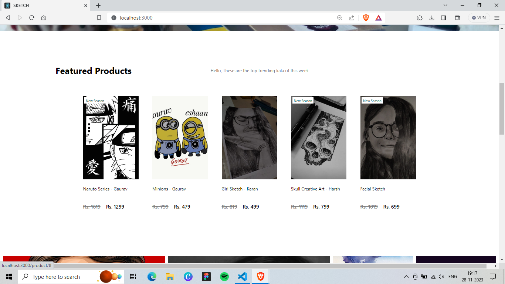
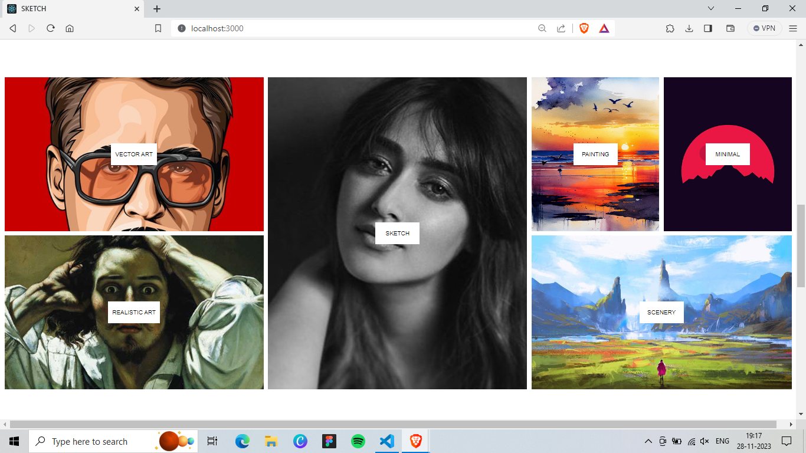
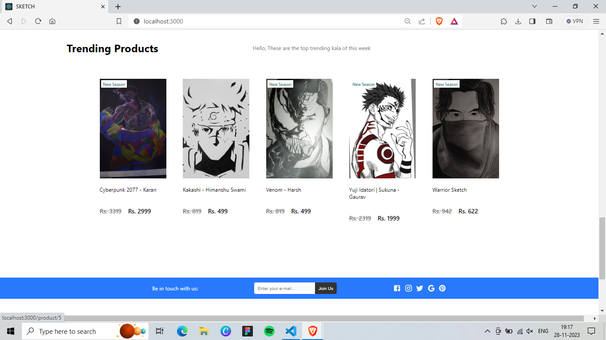
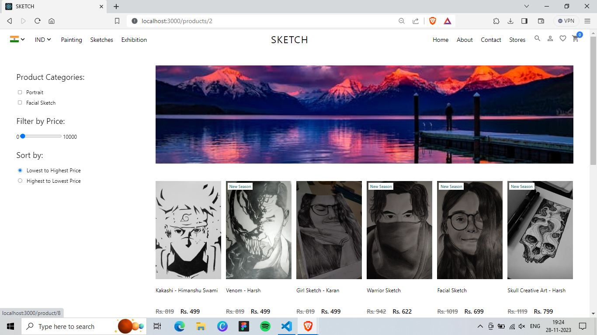
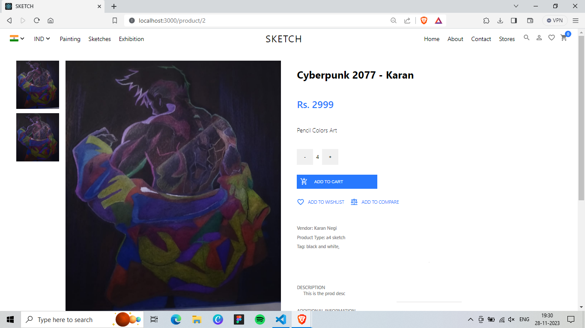
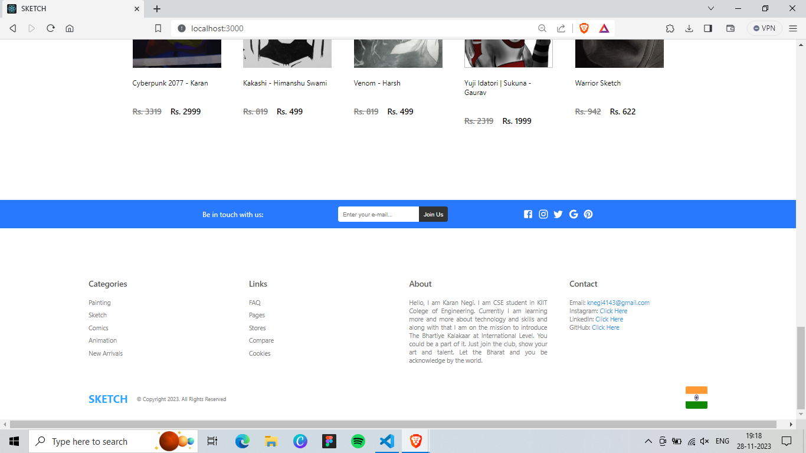

# SKETCH eCommerce Website

SKETCH is a full-fledged eCommerce platform designed to provide a seamless shopping experience with robust payment protection features. Built using HTML, CSS, JavaScript, Yarn, React, Strapi, and Stripe, SKETCH ensures secure transactions and a user-friendly interface.

> [!NOTE]
> SETTING UP PROJECT INFO IS AT BOTTOM OF THE PAGE.

## Home Screen
This is the Home Page / Landing Page which keeps sliding after a time frame presenting highlighted artworks.


## Featured Products
This Card Sections shows the Featured Products and also is a source of main income source for website owner as the Artist can pay to feature his product on website.



## Gallery
It shows the few key categories of the art works nd is flexible with the screen size.



# Trending Products
This Card Scetion shows the most trending products of the week which is most likely visited or bought by the customers.



# Products Page
It shows All the Products available and also filter option is available to get precise results.



# Single Product Page
It shows the complete single product along with its full details.



# Footer
This is Footer containing extra links or additional information.



## Features

- **End-to-End Payment Protection:** Secure payment processing with Stripe integration ensures customer transactions are safe and reliable.
- **Responsive Design:** Designed using modern web technologies, SKETCH offers a responsive and intuitive interface across devices.
- **Customizable Admin Dashboard:** Manage products, orders, and customers effortlessly with Strapi's powerful admin panel.
- **Dynamic Frontend:** Utilizing React and Yarn, SKETCH delivers dynamic and interactive user experiences.

## Technologies Used

- **Frontend:** HTML, CSS, JavaScript, React
- **Backend:** Strapi
- **Payment Gateway:** Stripe
- **Package Manager:** Yarn


## Getting Started

To get started with SKETCH eCommerce website locally, follow these steps:

1. **Clone the repository:**
```
git clone https://github.com/KaranOO/SKETCH.git
cd api
```

2. **Install dependencies:**
```
yarn install
npx create-strapi-app@latest
```

3. **Set up Strapi backend:**
- Follow Strapi documentation to set up your backend and configure necessary models and APIs. Also, if you are beginner then detailed instructions step wise are given below.

4. **Configure Stripe:**
- Sign up for a Stripe account and configure your API keys in the appropriate files. Also, if you are beginner then detailed instructions step wise are given below.

Here are the steps: After writing command to install strapi app in api directory. Once wrote this command - "npx create-strapi-app@latest"
Then select **CUSTOM** setting to setup the file
 - Select **JACASCRIPT** as preferred language
 - Select **mysql** as databse
 - Name database as **store**
 - Leave host and port as it is. Just hit enter.
 - Choose UserName. _I chose it as **root**_
 - Choose Password. _I set it as **db123**_
 - Hit **"n"** for SSL Certificate as it is just development purpose.
> [!NOTE]
> In case you face an error, just open mysql and create new schema there named **"store"**.
  - write this command in the api directory terminal
```
yarn develop
```
  - Now setip Strapi Store. You can go with documentatin of STRAPI.


5. **Run the development server in client:**
```
yarn start
```

> [!NOTE]
> You must set up STRAPI and STRIPE before running this project. It is not hard to setup. Here are the steps.

> [!NOTE]
> 1. First Login on STRAPI and STRIPE.
> 2. Copy your secret API key
> 3. Create a **".env"** file in client Directory and one **".env"** file in api Directory.
> 4. Now goto **ENVIRONMENT** file above and paste the necessary content in their respective files.
> 5. Also, make sure the correct secret API keys are pasted at right place.

> [!CAUTION]
> DO NOT SHARE YOUR API SECRET KEY with anyone.
