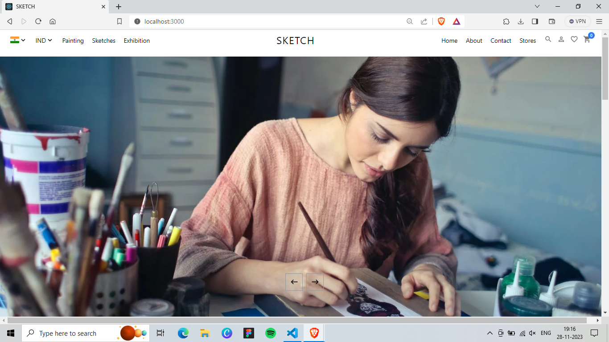

# SKETCH eCommerce Website

SKETCH is a full-fledged eCommerce platform designed to provide a seamless shopping experience with robust payment protection features. Built using HTML, CSS, JavaScript, Yarn, React, Strapi, and Stripe, SKETCH ensures secure transactions and a user-friendly interface.

> [!NOTE]
> SETTING UP PROJECT INFO IS AT BOTTOM OF THE PAGE.

## Home Screen
This is the Home Page / Landing Page which keeps sliding after a time frame presenting highlighted artworks.



## Featured Products
This Card Sections shows the Featured Products and also is a source of main income source for website owner as the Artist can pay to feature his product on website.


## Gallery
It shows the few key categories of the art works nd is flexible with the screen size.


# Trending Products
This Card Scetion shows the most trending products of the week which is most likely visited or bought by the customers.


# Products Page
It shows All the Products available and also filter option is available to get precise results.


# Single Product Page
It shows the complete single product along with its full details.


# Footer
This is Footer containing extra links or additional information.


## Features

- **End-to-End Payment Protection:** Secure payment processing with Stripe integration ensures customer transactions are safe and reliable.
- **Responsive Design:** Designed using modern web technologies, SKETCH offers a responsive and intuitive interface across devices.
- **Customizable Admin Dashboard:** Manage products, orders, and customers effortlessly with Strapi's powerful admin panel.
- **Dynamic Frontend:** Utilizing React and Yarn, SKETCH delivers dynamic and interactive user experiences.

## Technologies Used

- **Frontend:** HTML, CSS, JavaScript, React
- **Backend:** Strapi
- **Payment Gateway:** Stripe
- **Package Manager:** Yarn


## Getting Started

To get started with SKETCH eCommerce website locally, follow these steps:

1. **Clone the repository:**
```
git clone https://github.com/your/repository.git
cd repository-folder
```

2. **Install dependencies:**
```
yarn install
```

3. **Set up Strapi backend:**
- Follow Strapi documentation to set up your backend and configure necessary models and APIs.

4. **Configure Stripe:**
- Sign up for a Stripe account and configure your API keys in the appropriate files.

5. **Run the development server:**
```
yarn start
```

> [!NOTE]
> You must set up STRAPI and STRIPE before running this project. It is not hard to setup. Here are the steps.

> [!NOTE]
> 1. First Login on STRAPI and STRIPE.
> 2. Copy your secret API key
> 3. Create a **".env"** file in client Directory and one **".env"** file in api Directory.
> 4. Now goto **ENVIRONMENT** file above and paste the necessary content in their respective files.
> 5. Also, make sure the correct secret API keys are pasted at right place.

> [!CAUTION]
> DO NOT SHARE YOUR API SECRET KEY with anyone.
